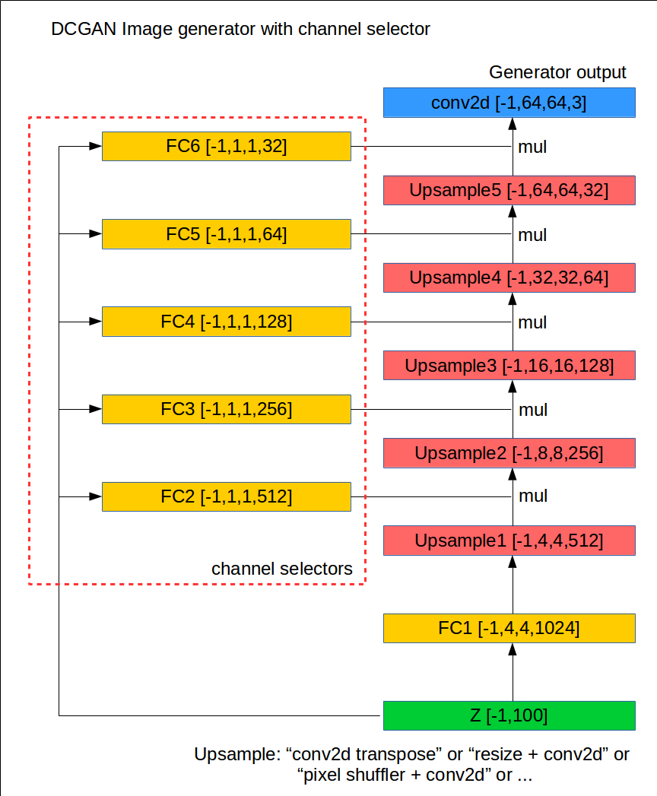

# gan_with_channel_selector
DCGAN with channel selector layer to avoid few variation output.

written with TensorFlow

other specs

- least square loss
- D/G sigmoid output
- resize bilinear upscale

