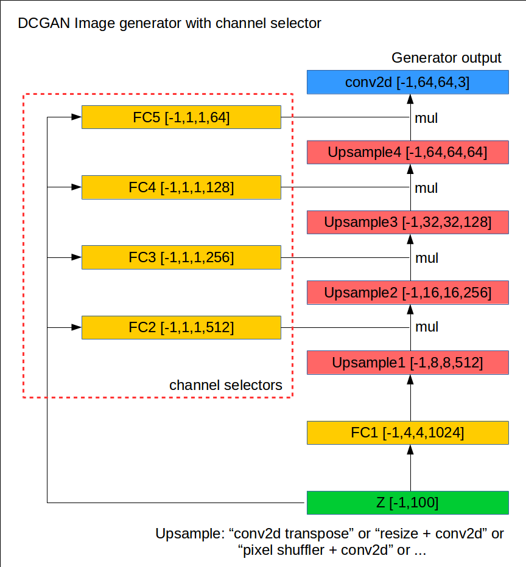

# gan_with_channel_selector
DCGAN with channel selector layer to avoid few variation output.

written with TensorFlow

other specs

- least square loss
- D/G sigmoid output
- resize bilinear upscale
- train strategy
  - if D's real sample correct rate < 0.5 or D's fake sample correct rate < 0.5 then train D and G
  - else train only generator

